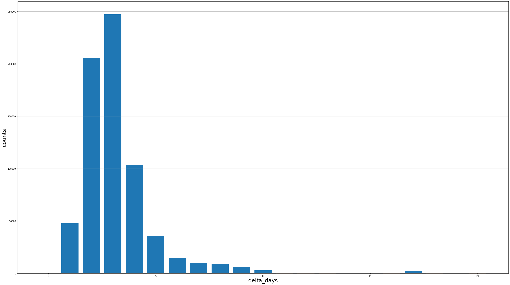
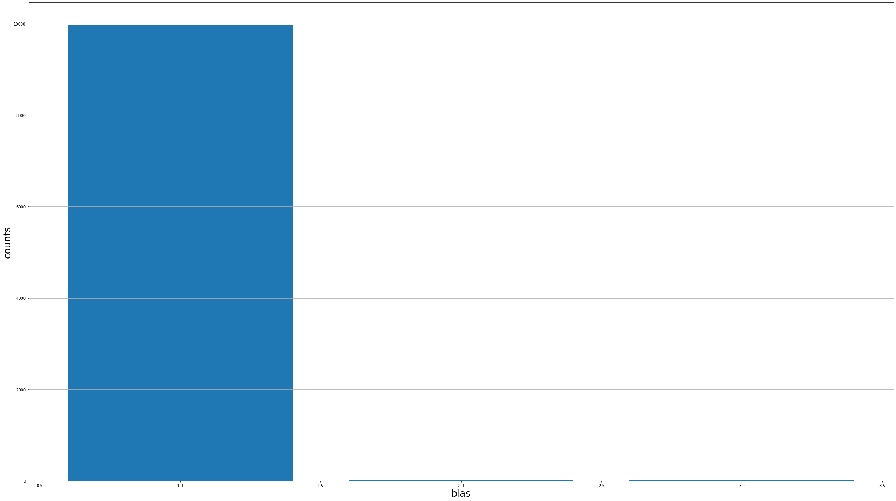

# SeedCup2019 决赛报告——hhhhh

**决赛名次：** 第一名

**队伍：** hhhhh

**队员：** 林德铝、陈琦


## 源码目录

```shell
.
├── config.py
├── createNewTest.py
├── data
│   ├── all.csv
│   ├── data prepared.ipynb
│   ├── evaluate.csv
│   ├── SeedCup_final_test.csv
│   ├── SeedCup_final_train.csv
│   ├── test.csv
│   ├── test_new.csv
│   └── train.csv
├── dataset.py
├── evaluation.py
├── model
│   ├── Classification.pkl
│   ├── NeuralNet.pkl
│   └── Regression.pkl
├── net
│   ├── Classification.py
│   ├── FullConnected.py
│   ├── __init__.py
│   └── Regression.py
├── show.py
├── test.py
├── train_Classification.py
├── train.py
├── train_Regression.py
└── utils.py
```

## 运行

### 运行环境

* python-3.7.3
* pytorch-1.2.0
* numpy-1.16.4
* pandas-0.24.2
* tqdm-4.32.1
* datetime
* dateutil

### 运行方法

**训练**

```shell
python src/train.py
```

**验证**

```shell
python src/evaluate.py
```

**测试**

```shell
python src/test.py
```

## 模型详细结构

### 数据准备

* 训练数据的字段包括`'uid'` `'plat_form'` `'biz_type'` `'create_time'` `'payed_time'` `'product_id'` `'cate1_id'` `'cate2_id'` `'cate3_id'` `'preselling_shipped_time'` `'seller_uid'` `'company_name'` `'lgst_company'` `'warehouse_id'` `'shipped_prov_id'` `'shipped_city_id'` `'rvcr_prov_name'` `'rvcr_city_name'` `'shipped_time'` `'got_time'` `'dlved_time'` `'signed_time'`

* 其中`'lgst_company'` `'warehouse_id'` `'shipped_prov_id'` `'shipped_city_id'`以及 `'shipped_time'` `'got_time'` `'dlved_time'` `'signed_time'`在测试集数据中缺失，目的是为了预测 `'signed_time'`，精确到小时

* 预测`'signed_time'`分为两步：

  * 预测从订单支付到签收的天数差
  * 预测签收时间 (精确到小时)

* 字段筛选

  * 用户随时间变化具有极不确定性，且常理可知用户身份与签收时间没有必然关系
  * 订单发货上路的时间与订单创建时间无必然关系，因为订单要支付后商家才会安排发货
  * 订单从支付到签收的天数差与支付日期无必然关系(除非特殊日期，如11.11)，但跟支付的时间有必然关系，如早上支付可当天发货，而晚上发货只能隔日发货
  * 虽然商品预售时间噪声严重，但部分预售时间和签收时间有着较强烈的关系

  综上所述，剔除`'uid'` `'create_time'` ，将`'payed_time'`仅保留支付时间(精确到小时)，将`'preselling_shipped_time'`去噪后计算与支付时间天数差并保留，其余字段暂时保留备用，以便于后期再筛选调节

* 数据划分

  为了本地验证方便，将原始训练数据划分为训练集和验证集，考虑到训练集是四月份数据，测试集是五月份数据。本质上为了预测未来的签收时间，因此不再随机划分训练集和验证集，而是将支付时间在4月25日之前的划分为训练集 (约80%)，4月25日及之后划分为验证集 (约20%)。实验证明这样划分的验证分数比随机划分更接近于提交的测试集分数。

* 数据准备的代码位于`src/data/data prepared.ipynb`，该代码用于剔除噪声并处理数据生成训练文件、验证文件以及测试文件

  **核心处理代码**

  ```python
  import pandas as pd
  import datetime
  from tqdm import tqdm
  from dateutil.relativedelta import relativedelta
  import numpy as np
  
  df = pd.read_csv('SeedCup_final_train.csv', sep='\t')
  d = df.to_dict(orient='list')
  
  def s2h(s1, s2):
      d1 = datetime.datetime.strptime(s1, '%Y-%m-%d %H:%M:%S')
      d2 = datetime.datetime.strptime(s2, '%Y-%m-%d %H:%M:%S')
      d1_ = d1.replace(minute=0)
      d1_ = d1_.replace(second=0)
      d1_ = d1_.replace(hour=0)
      d2_ = d2.replace(minute=0)
      d2_ = d2_.replace(second=0)
      d2_ = d2_.replace(hour=0)
      d = d1_-d2_
      
      return d.days, d1.hour, d2.hour
      
  keys_1 = ['plat_form', 'biz_type', 'product_id', 'cate1_id', 'cate2_id', 'cate3_id', 'seller_uid', 'company_name', 'lgst_company', 'warehouse_id', 'shipped_prov_id', 'shipped_city_id', 'rvcr_prov_name', 'rvcr_city_name', 'payed_hour', 'shipped_time_day', 'shipped_time_hour', 'got_time_day', 'got_time_hour', 'dlved_time_day', 'dlved_time_hour', 'delta_days', 'hour', 'pre_days', 'signed_time', 'payed_time']
  keys_2 = ['plat_form', 'biz_type', 'product_id', 'cate1_id', 'cate2_id', 'cate3_id', 'seller_uid', 'company_name', 'lgst_company', 'warehouse_id', 'shipped_prov_id', 'shipped_city_id', 'rvcr_prov_name', 'rvcr_city_name', 'signed_time', 'payed_time']
  out_d = {}
  for k in keys_1:
      out_d[k] = []
  for i in tqdm(range(len(d['uid']))):
      try:
          days_s, hour_s, _ = s2h(d['shipped_time'][i], d['payed_time'][i])
          days_g, hour_g, _ = s2h(d['got_time'][i], d['payed_time'][i])
          days_d, hour_d, _ = s2h(d['dlved_time'][i], d['payed_time'][i])
          days, hour, payed_hour = s2h(d['signed_time'][i], d['payed_time'][i])
          pre = d['preselling_shipped_time'][i]
          if days < 0 or days_s < 0 or days_g < 0 or days_d < 0:
              continue
          if hour < 0 or hour > 24:
              continue
              
      except:
          continue
      for k in keys_2:
          out_d[k].append(d[k][i])
      out_d['shipped_time_day'].append(days_s)
      out_d['shipped_time_hour'].append(hour_s)
      out_d['got_time_day'].append(days_g)
      out_d['got_time_hour'].append(hour_g)
      out_d['dlved_time_day'].append(days_d)
      out_d['dlved_time_hour'].append(hour_d)
      out_d['payed_hour'].append(payed_hour)
      out_d['delta_days'].append(days)
      out_d['hour'].append(hour)
      if pre != '0' and pre > d['payed_time'][i] and pre < d['signed_time'][i]:
          d1 = datetime.datetime.strptime(d['preselling_shipped_time'][i], '%Y-%m-%d %H:%M:%S')
          d2 = datetime.datetime.strptime(d['payed_time'][i], '%Y-%m-%d %H:%M:%S')
          dd = d1-d2
          out_d['pre_days'].append(min([6, dd.days]))
      else:
          out_d['pre_days'].append(0)
         
  keys = out_d.keys()
  d_train = {}
  d_eval = {}
  for k in keys:
      d_train[k] = []
      d_eval[k] = []
  for i in tqdm(l):
      if out_d['payed_time'][i] < '2019-04-25':
          for k in keys:
              d_train[k].append(out_d[k][i])
      else:
          for k in keys:
              d_eval[k].append(out_d[k][i])
              
  df = pd.DataFrame(d_train)
  df.to_csv('train.csv', index=False)
  df = pd.DataFrame(d_eval)
  df.to_csv('evaluate.csv', index=False)
  ```

### COST函数

* 考虑到准时率需要达到98%方可上榜，需要对预测天数差的进行偏好设置，使其倾向于提高准时率。为了使其更有针对性地提升准时率，对准时率未达到要求的数据进行对网络的针对性调整，我们使用了`sign`函数设计了一个具有针对性效果的代价函数。
$$
  Loss=(\frac {sign(x-y)+1}{2}\times scale+1)\times (x-y)^2
$$
  **代价函数代码 (src/utils.py)**

  ```python
  from torch import nn
  import torch
  
  class MyCost(nn.Module):
      def __init__(self, config):
          super(MyCost, self).__init__()
          self.config = config
  
      def forward(self, x, y):
          delta = x - y
          scale = (torch.sign(delta)+1)*0.5*self.config.scale
        return torch.sum(torch.pow(delta, 2) * (scale + 1))
  ```


### 网络结构

* 使用简单的感知机来拟合天数差和签收时间，其中共享层以及两个输出的网络层均使用以`ReLu`作为激活函数并包含`Dropout`和`Normalization`的数层感知机。


* 创新过程

  * 增加共享网络层，有助于整体特征的提取

  * 加入了`Dropout`和`Normalization`，防止模型过拟合并使模型更易于训练

  * 尝试使用测试集没有的字段(`'shipped_time'` `'got_time'` `'dlved_time'` )对模型进行多任务训练以微调embedding层和共享网络层，但实际上效果没有提升甚至会差一些，考虑到是因为快递员和商家填写有延时而导致的噪声，使得数据并不拟合。因此放弃该方案。

  * 尝试使用对测试集没有的字段进行填补，`'lgst_company'` `'warehouse_id'` `'shipped_prov_id'` `'shipped_city_id'`使用分类器(`src/net/Classification.py`)填补，`'shipped_time'` `'got_time'` `'dlved_time'` 使用回归器(`src/net/Regression.py`)填补。然而效果依旧不尽人意，考虑到依旧是因为噪声问题，且模型的效果对分类器和回归器的依赖大，不够稳定。因此放弃该方案。

  * 尝试加入残差线性层，为了使其在网络加深的同时训练更为平滑。但加入残差层后的验证损失会有跳跃的迹象，且难以收敛。因此放弃该方案。

    **残差模块**

    ```python
    class block(nn.Module):
        def __init__(self, in_dim, out_dim, scale=0.2):
            super(block, self).__init__()
            if in_dim != out_dim:
                self.layer_1 = nn.Sequential(
                    nn.Linear(in_dim, out_dim),
                    nn.BatchNorm1d(out_dim),nn.Dropout(),
                    nn.ReLU(inplace=True)
                )
            else:
                self.layer_1 = None
            
            self.layer_2 = nn.Sequential(
                nn.Linear(out_dim, out_dim),
                nn.BatchNorm1d(out_dim),
                nn.ReLU(inplace=True),
                nn.Linear(out_dim, out_dim),
                nn.BatchNorm1d(out_dim),
            )
    
            self.scale = scale
    
        def forward(self, x):
            if self.layer_1 != None:
                x = self.layer_1(x)
            output = self.layer_2(x)
            output = self.scale*output + x
            return output
    ```

  * 在`output`前加入`clamp`考虑到神经网络的初始化均值为0，且Normalization也是使网络参数为0，因此在未训练时输出的均值也为0，我们为了使网络更易收敛，使用`clamp`使其在最大概率的输出为0，如天数差分布最多的是3天，则使用`torch.clamp(d['delta_days'], -3, 15)+3`来使其最大概率的输出为0。该方案可以使模型提升`2~3`个点。

  **核心代码**

  ```python
  class NeuralNet(nn.Module):
      def __init__(self, config):
          super(NeuralNet, self).__init__()
          self.em_dic = {}
          self.plat_form_em = nn.Embedding(config.plat_form_range,
                                                  config.embadding_dim)
          self.biz_type_em = nn.Embedding(config.biz_type_range,
                                                 config.embadding_dim)
          self.product_id_em = nn.Embedding(config.product_id_range, 
                                            		config.embadding_dim)
          self.cate1_id_em = nn.Embedding(config.cate1_id_range,
                                                 config.embadding_dim)
          self.cate2_id_em = nn.Embedding(config.cate2_id_range,
                                                 config.embadding_dim)
          self.cate3_id_em = nn.Embedding(config.cate3_id_range,
                                                 config.embadding_dim)
          self.seller_uid_em = nn.Embedding(config.seller_uid_range,
                                                   config.embadding_dim)
          self.company_name_em = nn.Embedding(config.company_name_range,
                                                     config.embadding_dim)
          self.rvcr_prov_name_em = nn.Embedding(
              config.rvcr_prov_name_range, config.embadding_dim)
          self.rvcr_city_name_em = nn.Embedding(
              config.rvcr_city_name_range, config.embadding_dim)
  
          self.pre_days_em = nn.Embedding(config.pre_days_range, config.embadding_dim)
          self.payed_hour_em = nn.Embedding(config.payed_hour_range, config.embadding_dim)
  
          self.em_dic['plat_form'] = self.plat_form_em
          self.em_dic['biz_type'] = self.biz_type_em
          self.em_dic['product_id'] = self.product_id_em
          self.em_dic['cate1_id'] = self.cate1_id_em
          self.em_dic['cate2_id'] = self.cate2_id_em
          self.em_dic['cate3_id'] = self.cate3_id_em
          self.em_dic['seller_uid'] = self.seller_uid_em
          self.em_dic['company_name'] = self.company_name_em
          self.em_dic['rvcr_prov_name'] = self.rvcr_prov_name_em
          self.em_dic['rvcr_city_name'] = self.rvcr_city_name_em
          self.em_dic['payed_hour'] = self.payed_hour_em
          self.em_dic['pre_days'] = self.pre_days_em
          self.em_keys = self.em_dic.keys()
  
          self.pre_dic = {}
  
          self.share_layer = nn.Sequential(
              nn.Linear(len(self.em_dic) * config.embadding_dim, 4096),
              nn.BatchNorm1d(4096),nn.Dropout(config.dropout_rate),
              nn.ReLU(inplace=True),
              nn.Linear(4096, 4096),
              nn.BatchNorm1d(4096),nn.Dropout(config.dropout_rate),
              nn.ReLU(inplace=True)
          )
  
          self.delta_days_pres = [block(config.fc_cells, config.fc_cells) for i in range(config.num_blocks)]
          self.delta_days_pre = nn.Sequential(
              nn.Linear(config.blocks[-1], config.fc_cells),
              nn.BatchNorm1d(config.fc_cells),nn.Dropout(config.dropout_rate),
              nn.ReLU(inplace=True),
              nn.Linear(
                  config.fc_cells, config.fc_cells), 
              nn.BatchNorm1d(config.fc_cells),
              nn.Dropout(config.dropout_rate),
              nn.ReLU(inplace=True),
              nn.Linear(
                  config.fc_cells, config.fc_cells), 
              nn.BatchNorm1d(config.fc_cells),
              nn.Dropout(config.dropout_rate),
              nn.ReLU(inplace=True),
              nn.Linear(
                  config.fc_cells, config.fc_cells), 
              nn.BatchNorm1d(config.fc_cells),
              nn.Dropout(config.dropout_rate),
               nn.Linear(
                  config.fc_cells, config.fc_cells), 
              nn.BatchNorm1d(config.fc_cells),
              nn.Dropout(config.dropout_rate),
              nn.ReLU(inplace=True),
              *self.delta_days_pres,
              nn.Linear(config.fc_cells, 1))
             
          self.hour_pres = [block(config.fc_cells, config.fc_cells) for i in range(config.num_blocks)]
          self.hour_pre = nn.Sequential(
              nn.Linear(config.blocks[-1], config.fc_cells),
              nn.BatchNorm1d(config.fc_cells), nn.Dropout(config.dropout_rate),
              nn.ReLU(inplace=True),
              nn.Linear(
                  config.fc_cells, config.fc_cells), 
              nn.BatchNorm1d(config.fc_cells),
              nn.Dropout(config.dropout_rate),
              nn.ReLU(inplace=True),
              nn.Linear(
                  config.fc_cells, config.fc_cells), 
              nn.BatchNorm1d(config.fc_cells),
              nn.Dropout(config.dropout_rate),
              nn.ReLU(inplace=True),
              nn.Linear(
                  config.fc_cells, config.fc_cells), 
              nn.BatchNorm1d(config.fc_cells),
              nn.Dropout(config.dropout_rate),
              
              nn.ReLU(inplace=True),
              nn.Linear(config.fc_cells, config.fc_cells),
              nn.BatchNorm1d(config.fc_cells), 
              nn.Dropout(config.dropout_rate), 
              
              nn.ReLU(inplace=True), 
              *self.delta_days_pres,
              nn.Linear(config.fc_cells, 1))
  
          self.scale_dic = {'delta_days':1, 'hour':1, 'shipped_time_day':1, 'shipped_time_hour':1, 'got_time_day':1,'got_time_hour':1, 'dlved_time_day':1,'dlved_time_hour':1 }
  
          self.pre_dic['delta_days'] = self.delta_days_pre
          self.pre_dic['hour'] = self.hour_pre
          self.pre_keys = self.pre_dic.keys()
  
  
      def forward(self, dic):
          em_list = [self.em_dic[k](dic[k]) for k in self.em_keys]
          em_vec = torch.cat(em_list, dim=1)
          em_vec = self.share_layer(em_vec)
  
          d = {}
          for k in self.pre_keys:
              d[k] = self.pre_dic[k](em_vec)*self.scale_dic[k]
          d['delta_days'] = torch.clamp(d['delta_days'], -3, 15)+3
          d['hour'] = torch.clamp(d['hour'], 3, 23) 
          return d
  ```

### 数据分析

- 总体数据分析

  - 总体数据描述

    |       | plat_form   | biz_type    | product_id      | cate1_id     | cate2_id      | cate3_id      | seller_uid    | company_name  | lgst_company | warehouse_id | shipped_prov_id | shipped_city_id | rvcr_prov_name | rvcr_city_name | payed_hour   | shipped_time_day | shipped_time_hour | got_time_day | got_time_hour | dlved_time_day | dlved_time_hour | delta_days  | hour         | pre_days    |
    | ----- | ----------- | ----------- | --------------- | ------------ | ------------- | ------------- | ------------- | ------------- | ------------ | ------------ | --------------- | --------------- | -------------- | -------------- | ------------ | ---------------- | ----------------- | ------------ | ------------- | -------------- | --------------- | ----------- | ------------ | ----------- |
    | count | 3596748     | 3596748     | 3596748         | 3596748      | 3596748       | 3596748       | 3596748       | 3596748       | 3596748      | 3596748      | 3596748         | 3596748         | 3596748        | 3596748        | 3596748      | 3596748          | 3596748           | 3596748      | 3596748       | 3596748        | 3596748         | 3596748     | 3596748      | 3596748     |
    | mean  | 1.885894980 | 4.573349314 | 71718.044190196 | 16.274078417 | 117.542867056 | 659.854008398 | 532.346120439 | 464.880631336 | 8.707816616  | 9.351768041  | 9.784448340     | 62.875307082    | 15.746761797   | 200.197294889  | 14.462963766 | 0.767298682      | 12.771582273      | 0.951404435  | 15.506264825  | 1.077317343    | 16.482430239    | 3.166825977 | 14.330974813 | 0.265636903 |
    | std   | 0.463899401 | 0.902947376 | 40798.739581189 | 8.636029807  | 80.348072864  | 424.471620550 | 274.170150119 | 274.262462148 | 3.149203035  | 2.077681741  | 8.480154153     | 32.597161975    | 9.612333705    | 118.645877146  | 5.503944137  | 1.259611240      | 3.902852462       | 1.385282633  | 4.509133532   | 1.446303174    | 6.097486027     | 1.705711866 | 3.178422244  | 1.108358392 |
    | min   | 0           | 0           | 0               | 0            | 0             | 0             | 0             | 0             | 0            | 0            | 0               | 0               | 0              | 0              | 0            | 0                | 0                 | 0            | 0             | 0              | 0               | 0           | 0            | 0           |
    | 25%   | 2           | 4           | 35451           | 5            | 61            | 323           | 324           | 231           | 8            | 10           | 3               | 35              | 9              | 87             | 10           | 0                | 10                | 0            | 13            | 0              | 15              | 2           | 12           | 0           |
    | 50%   | 2           | 5           | 74987           | 22           | 116           | 554           | 562           | 482           | 9            | 10           | 5               | 65              | 16             | 188            | 14           | 1                | 12                | 1            | 16            | 1              | 19              | 3           | 14           | 0           |
    | 75%   | 2           | 5           | 107013          | 24           | 177           | 885           | 766           | 668           | 11           | 10           | 18              | 85              | 25             | 307            | 20           | 1                | 16                | 1            | 19            | 1              | 20              | 4           | 17           | 0           |
    | max   | 4           | 5           | 141433          | 26           | 271           | 1608          | 999           | 950           | 16           | 11           | 27              | 117             | 32             | 434            | 23           | 74               | 23                | 74           | 23            | 74             | 23              | 77          | 23           | 14          |

  - 主要数据分布

    - 配送天差分布

      

    - 签收小时分布

      

- 训练集数据分析

  - 配送天数分布

    

  - 签收小时分布

    

- 验证测试集分析

  - 配送天数分布

    

  - 签收小时分布

    

- 测试集数据分析反馈过程

  - 由于每日提交的次数有限，因而需要利用好测试数据，根据测试数据的反馈，来对即将提交数据进行评估，以及对模型进行改进
  - 此外，在决赛的初期由于数据分割不恰当，发现验证集上对误差的往往不具有参考价值，比如说在验证集上`rankScore`可以达到30，`onTimePercent`达到99% ，但在测试集上`rankScore`为47 `onTimePercent` 不满98，因而验证集上的误差难以对模型的效果进行评估，需要从提交测试集上获得反馈

  以下举例说明该过程

  例：某一提交测试集(以下均为真实数据得分)

  - rankScore：40.8 

    onTimePercent：98.3%

    - 配送天数分布

      ```
      data_98
      delta_days
      0      5290
      1     78548
      2    142307
      3     53837
      4      9602
      5      6418
      6      2595
      7      1279
      8       116
      9         8
      ```

      

  - 新测试数据得分 

    - 配送天数分布

      ```
      delta_days
      1      61847
      2     151203
      3      64977
      4       8603
      5       7883
      6       3367
      7       1710
      8        391
      9         18
      10         1
      ```

      

    - 新测试数据与该提交数据对比

      - 负偏差(即新测试数据预测日期比提交数据**早**的数据统计)

        ```
        negetive bias distribution
         [   1 9966]
         [   2   22]
         [   3    9]
        ratio 0.03332333333333334
        ```

        

      - 正偏差(即新测试数据预测日期比提交数据**晚**的数据统计)

        ```
        positive bias distribution
         [    1 56800]
         [    2   498]
         [    3    10]
        ratio 0.19102666666666668
        ```

        


        对于该测试集的预测值可以发现正偏差占比远远大于负偏差
    
        由于评价指标的要求，我们希望模型预测的时间更加精确，而且使得准时率能够达到要求。换而言之，就是希望预测的时间间隔更大一些，并且这个'大'的程度能能同时满足减少`rankScore`和使`onTimePercent`达标。
    
        因此，在不同的预测结果中，便可以通过比较其分布，相对于对同一数据偏差值和偏差比例来进行权衡与选择。
    
        最后，该预测结果的得分为`rankScore：37.8` `onTimePercent：97.8%`。不可否认其大大减少了`rankScore` ，但`onTimePercent`并没有达到门槛值。在没有更好的的模型，或值得尝试的数据分布出现前，我们暂时认为正偏差比例应该小0.1910。

  - 当无法辨别哪个预测结果更优的时候，可以通过模型融合来生成新的提交数据

  - 此外，还能发现的是，测试集、验证集和测试集上数据分布的差别，也从另一方面说明了，预测集上的得分效果不足以代表测试集上的得分

### 模型优化及融合

- 参数结构调整

  可调整的参数主要有一下几点

  - 自定义损失函数的scale

    ```python
    from torch import nn
    import torch
    
    class MyCost(nn.Module):
        def __init__(self, config):
            super(MyCost, self).__init__()
            self.config = config
    
        def forward(self, x, y):
            delta = x - y
            scale = (torch.sign(delta)+1)*0.5*self.config.scale
            return torch.sum(torch.pow(delta, 2) * (scale + 1))
    ```

  - clamp区间

    通过修改clamp区间调整输出的分布

    ```python
    d['delta_days'] = torch.clamp(d['delta_days'], -3, 15)+3
    d['hour'] = torch.clamp(d['hour'], 3, 23) 
    ```

    该设置是对整体的数据分布进行修改，在初赛中通过改变clamp区间是模型的rankScore提高2~3点。但在复赛中，由于问题的规模变大，对于整体数据的调整会导致大范围的偏移，使得onTimePercent大大降低

  - 整体损失的偏好设置

    ```python
    loss_all = conf.day_weight * loss_reg_day + loss_reg_hour
    ```

    通过调整day_weight改变对天数、小时惩罚的偏好比例

- 偏差矫正

  偏差矫正主要体现在对预测小时的矫正上，依据是验证集上对预测时间正负偏差的统计

  对小时数预测负偏差(预测小时数比真实小时数小,使用简单的`L2`损失函数)为`12.27`占比为`0.4823`；对小时数预测正偏差为`7.78`占比为`0.379`。该操作能够在不改变`onTimeScore`的情况下，降低`rankScore `0.5~1.5。

- 模型保存策略

  传统模型保存策略是选取验证集效果最好的模型，但是验证集最好并不能代表在测试集上表现最好，容易出现在验证集上的过拟合。因此，我们采用了更加平滑的模型保存策略，在验证集效果相差在1个点以内的模型便可以保存，以此来提升模型的鲁棒性。

  ```python
  if date_acc_e > conf.threshold and date_acc_t > conf.threshold and torch.sqrt(sum(loss_all) / len(loss_all)) < max_loss + 1:
      print('Saving model...')
      max_loss = torch.sqrt(sum(loss_all) / len(loss_all))
      torch.save(net.state_dict(), 'model/NeuralNet.pkl')
  ```

- 模型融合

  模型融合是通过对不同模型预测出的数据进行投票，选取得票最多的预测值，当所有预测值都不同的时候则选择日期最小的日测值，事实证明，通过模型融合，矫正了一些过大或者过小的数据，集成不同模型的优点，在降低`rankScore`的情况下同时保证了`onTimePercent`。目前最优的得分是通过模型融合得到的。

## 代码结构

### 数据模块

```shell
.
├── data
│   ├── all.csv
│   ├── data prepared.ipynb
│   ├── evaluate.csv
│   ├── SeedCup_final_test.csv
│   ├── SeedCup_final_train.csv
│   ├── test.csv
│   ├── test_new.csv
│   └── train.csv
```

* `SeedCup_final_test.csv`和`SeedCup_final_train.csv`为赛题原始文件，`all.csv`、`train.csv`、`evaluate.csv`和`test.csv`是原始文件经过`data prepared.ipynb`处理后所生成的文件，其中`all.csv`是原始的`SeedCup_final_train.csv`经过处理的文件，`train.csv`和`evaluate.csv`是经过上述划分办法所划分的训练集和验证集。`test_new.csv`是使用分类器和回归器对测试集进行填补的文件。

### 配置模块

```shell
.
├── config.py
```

* 在该配置文件中，配置了词向量的范围、词向量维度、`Dropout`参数、`CUDA`、`batch size`、`epochs`、学习率、是否加载模型、代价函数参数、天数差偏好设置、残差模块层数、全连接层参数、保存模型的阈值。

**配置代码**

```python
class Config():
    def __init__(self):
        self.plat_form_range = 5
        self.biz_type_range = 6
        self.product_id_range = 141434
        self.cate1_id_range = 27
        self.cate2_id_range = 272
        self.cate3_id_range = 1609
        self.seller_uid_range = 1000
        self.company_name_range = 951
        self.lgst_company_range = 17
        self.warehouse_id_range = 12
        self.shipped_prov_id_range = 28
        self.shipped_city_id_range = 118
        self.rvcr_prov_name_range = 33
        self.rvcr_city_name_range = 435
        self.payed_hour_range = 24
        self.pre_days_range = 15

        self.shipped_time_day_range = 30
        self.shipped_time_hour_range = 24
        self.got_time_day_range = 30
        self.got_time_hour_range = 24
        self.dlved_time_day_range = 30
        self.dlved_time_hour_range = 24

        self.embadding_dim = 64
        self.dropout_rate = 0.7

        self.CUDA = True
        self.batch_size = 4096
        self.EPOCHs = 1000
        self.lr = 1e-3
        self.resume = False
        self.scale = 30
        self.day_weight = 5
        self.day_reduce = 0

        self.num_blocks = 0
        self.fc_cells = 1024

        self.threshold = 0.996
```

### 网络模块

```shell
.
├── net
│   ├── Classification.py
│   ├── FullConnected.py
│   ├── __init__.py
│   └── Regression.py
```

* 其中`Classification.py`是对测试集缺失的离散类`'lgst_company'` `'warehouse_id'` `'shipped_prov_id'` `'shipped_city_id'`的分类器；`Regression.py`是对测试集缺失的连续类`'shipped_time'` `'got_time'` `'dlved_time'` 的回归器；`FullConnected.py`是预测签收时间的网络模型。

### 训练模块

```shell
.
├── train_Classification.py
├── train.py
├── train_Regression.py
```

* 其中`train_Classification.py`是对分类器的训练代码；`train_Regression.py`是对回归器的训练代码；`train.py`是对预测签收时间的网络模型的训练代码。

### 测试模块

```shell
.
├── createNewTest.py
├── test.py
```

* 其中`createNewTest.py`是使用分类器和回归器对测试集进行填补并生成`data/test_new.csv`文件；`test.py`是对签收时间进行预测并生成提交代码。

## 测试结果

**最终提交分数：38.3674**

**准时率：0.980**

**榜上排名：第一名**

